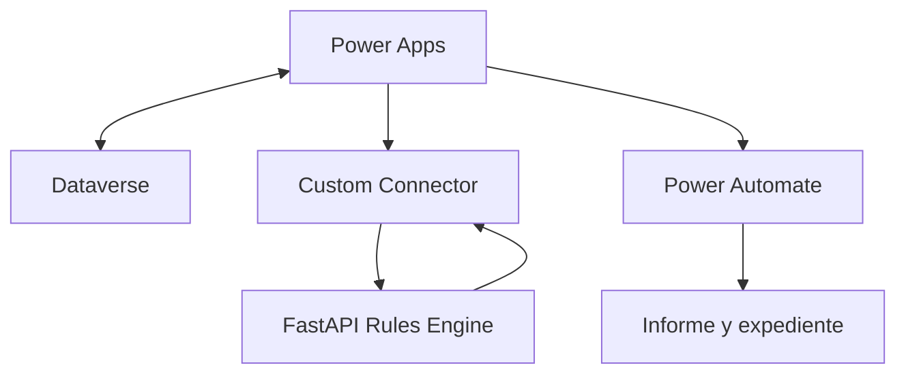

# Arquitectura

- Power Apps controla la experiencia, no la clasificacion juridica.
- Dataverse es el sistema de registro y auditoria.
- FastAPI recibe metadatos y respuestas, aplica un ruleset inmutable y devuelve trazas.
- Power Automate archiva el informe y gestiona revision/aprobacion.

